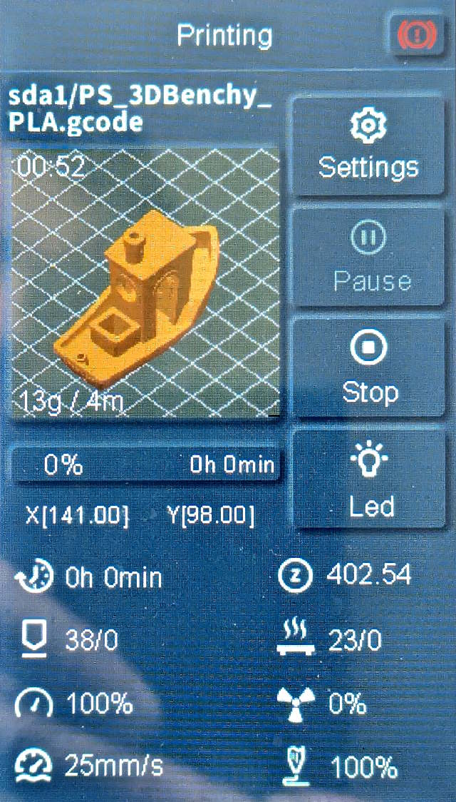
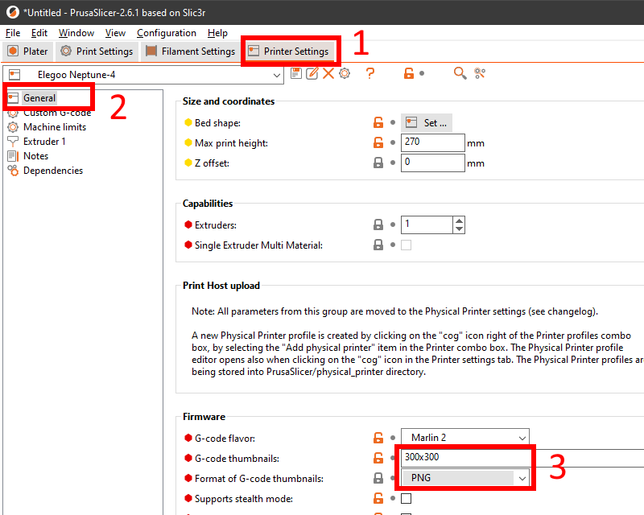
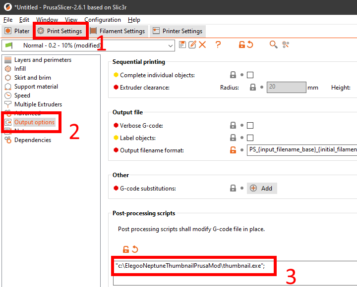

# Yet another PrusaSlicer/OrcaSlicer thumbnail script for Elegoo Neptune

This package converts the thumbnail that PrusaSlicer bakes into the g-code file into the format that is read by the Neptune printers.

## Why another mod?

I was not happy with previous implementations so tried to make it better. But ended up re-writing it :-)

Notable changes:
- Faster: it does not read all file content into memory, which is vital for big g-code files;
- Easier installation: image size should only be specified in printer settings and the script accepts PNG and JPG;
- More information on thumbnail: print duration, used filament weight, used filament length and model height;
- Better texts quality: texts added after image resizing, font size and texts positions adjusted automatically;
- Adjust g-code so completed percentage and remaining time are displayed correctly under the thumbnail (you need to tick "Support remaining times" checkbox in Printer Settings).

## Installation

- Download the [latest release](https://github.com/fifonik/ElegooNeptuneThumbnailPrusaMod/releases);
- Unzip the executable and put it to desired location.

## How to Setup PrusaSlicer for Post-Process Scripts

- 'Printer Settings' -- put something like `200x200` in 'Format of G-code thumbnails' (do not go too high in image resolution as the image injected in script by PrusaSlicer will be resized to 200x200 by the script anyway) and select `PNG` or `JPG` in 'Format of G-code thumbnails' (it may also work with QOI but I have not tested it):
  
- 'Print Settings' / 'Post-processing scripts' - specify path to executable: `"C:\ElegooNeptuneThumbnailPrusaMod\thumbnail.exe";`:
  

PrusaSlicer should now run the thumbnail.exe when you export your g-code.
In case of issues - check `thumbnail.log`.

If you do not specify any options, the first thumbnail from g-code file that is bigger than 100x100 will be used: decoded, resized to 200x200 + 160x160, encoded into new format and baked back into g-code file.

If PrusaSlicer is configured to add more than one thumbnail into g-code file, you can specify what thumbnail the script should use with option:
`--image_size WIDTHxHEIGHT`

## Running from the script

If you do not want to run the supplied executable, you can always run the Python script directly:
- Install Python;
- Clone the repo;
- Change the settings for 'Post-processing scripts' to `"C:\path\to\python.exe" "C:\ElegooNeptuneThumbnailPrusaMod\thumbnail.py";`
- If you want to hide the terminal window use: `"C:\path\to\pythonw.exe" "C:\ElegooNeptuneThumbnailPrusaMod\thumbnail.py";`

## Building your own executable from the script

- Install Python;
- Install pyinstaller: `pip install pyinstaller`;
- Clone the repo;
- Open console, navigate to the repo folder and run `pyinstaller build.spec` (or just run supplied `build.bat`) => thumbnail.exe will be created in `dist` folder.

## Compatibility

Works with these printers:

- NEPTUNE 3 PRO
- NEPTUNE 3 PLUS
- NEPTUNE 3 MAX
- NEPTUNE 4
- NEPTUNE 4 PRO
- NEPTUNE 4 PLUS
- NEPTUNE 4 MAX

Use the `--old_printer` argument for these printers:

- NEPTUNE 2
- NEPTUNE 2D
- NEPTUNE 2S
- NEPTUNE X

Tested with PrusaSlicer 2.6.1 and Neptune 4

Apple silicone will not work on the release. In order to run, you must run the script through an x86 python otherwise the dlls will not work. You can do this by installing the x86 Homebrew and Rosetta 2.

## Supported command line parameters

- `--short_duration_format`
  Use short format for print duration: 1d 23:45 instead of 1d 23h 45m 56s. Who need these seconds, really?
- `--debug`
  Put additional debug information into log file (`thumbnail.log`) and save resized images in program folder. I will ask you to run with the option and supply log in case you face any issues.
- `--old_printer`
  Generate thumbnails for Neptune 2 series printers & older
- `--image_size 200x200`
  Without this option the first thumbnail that is bigger than 100x100px from g-code file will be used.
  If specified, the script will try to find in g-code thumbnail with the specified image size. Script will report error if such thumbnail is not found. So I'd recommend not to use the option at all and only specify size 200x200 in 'Printer Settings'.

To add script's command line option in PrusaSlicer, make sure you wrap them in double quotes:
`"C:\ElegooNeptuneThumbnailPrusaMod\thumbnail.exe" "--image_size" "300x300";`

## Contribution

This repository is based on:
- [TheJMaster28/ElegooNeptuneThumbnailPrusa](https://github.com/TheJMaster28/ElegooNeptuneThumbnailPrusa)
- [Molodos/ElegooNeptuneThumbnails](https://github.com/Molodos/ElegooNeptuneThumbnails)
- [sigathi/ElegooN3Thumbnail](https://github.com/sigathi/ElegooN3Thumbnail)

Therefore it is released under the **AGPL v3** license.
